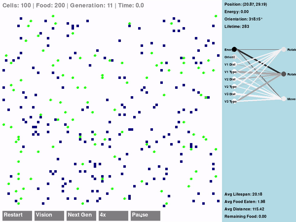
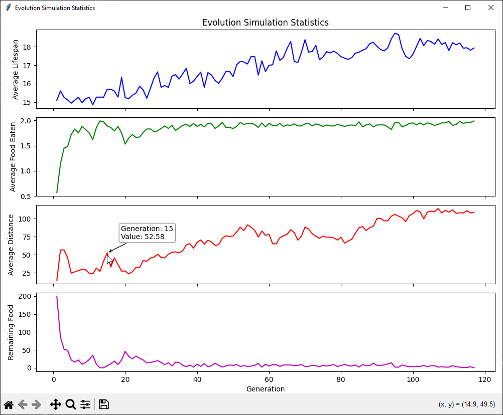

# Evolution Simulator

## Overview
This Evolution Simulator is a Python-based project that models the behavior and evolution of simple organisms (cells) in a 2D environment. The simulation demonstrates principles of artificial life, neural networks, and genetic algorithms.

Key aspects of the simulation:

- Cells move around a 2D grid, seeking food and avoiding starvation.
- Each cell is controlled by a simple neural network that determines its actions.
- Cells consume energy as they move and rotate, and gain energy by eating food.
- The environment is wrap-around, meaning cells that move off one edge appear on the opposite side.
- After a set time or when all cells die, the generation ends.
- Cells that survive longest and/or gather the most energy will create a new generation with small mutations in their "brains".
- Over generations, cells evolve to better navigate and survive in their environment.

## Neural Network Structure
Each cell in the simulation is controlled by a simple feedforward neural network with one hidden layer. The network takes sensory inputs from the cell and its environment and produces outputs that determine the cell's actions.

Inputs (8 neurons):
- Current energy level (1 neuron)
- Current orientation (1 neuron)
- Vision information (6 neurons):
  - 3 "vision" vectors, each with:
    - Distance to nearest object (limited range)
    - Type of object (food or nothing)

Outputs (3 neurons):
- Rotate clockwise
- Rotate counter-clockwise
- Move forward

The network uses a hyperbolic tangent (tanh) activation function, which outputs values between -1 and 1. The cell performs an action if the corresponding output neuron's value is greater than 0.5.

## Mutation Process
Mutation occurs when creating a new generation of cells. For each weight in the neural network:
- There's a chance (defined by MUTATION_RATE) that the weight will be mutated.
- If a mutation occurs, a random value (drawn from a normal distribution with mean 0 and standard deviation defined by MUTATION_AMOUNT) is added to the weight.

This process allows for gradual changes in the cells' behavior over generations, potentially leading to more adapted and efficient cells over time.

## Statistics tracked:
- Average lifespan of cells
- Average amount of food eaten per cell
- Average distance traveled by cells
- Remaining food at the end of each generation

## Vision System:
Cells have a limited vision range, allowing them to detect objects (food) within a certain distance in three directions (front, front-left, front-right).

## Demo

### Simulation in Action


### Statistics Plot


## Requirements
- Python 3.12.1

## Installation
1. Clone this repository
2. Create and activate a Python virtual environment
3. Install the required packages:
   ```
   pip install -r requirements.txt
   ```

## Usage
1. Run the main simulation:
   ```
   python src/main.py
   ```
2. After running a simulation, you can visualize the statistics:
   ```
   python src/plot_logs.py
   ```

## Controls
- "Vision" button: Toggle cell vision lines
- "Next Gen" button: Force start of next generation
- "Speed" button: Adjust simulation speed (Left-click to increase, Right-click to decrease)
- "Pause/Resume" button: Pause or resume the simulation
- "Restart" button: Restart the entire simulation with new random cells
- Spacebar: Pause/Resume the simulation

## Project Structure
- `src/`: Source code directory
  - `main.py`: Main entry point for the simulation
  - `engine.py`: Core simulation logic
  - `cell.py`: Cell class definition and neural network
  - `food.py`: Food class definition
  - `config.py`: Configuration settings
  - `plot_logs.py`: Script for visualizing simulation statistics
- `logs/`: Directory for simulation log files

## Contributing
Contributions to improve the simulation or add new features are welcome. Please fork the repository and create a pull request with your changes.